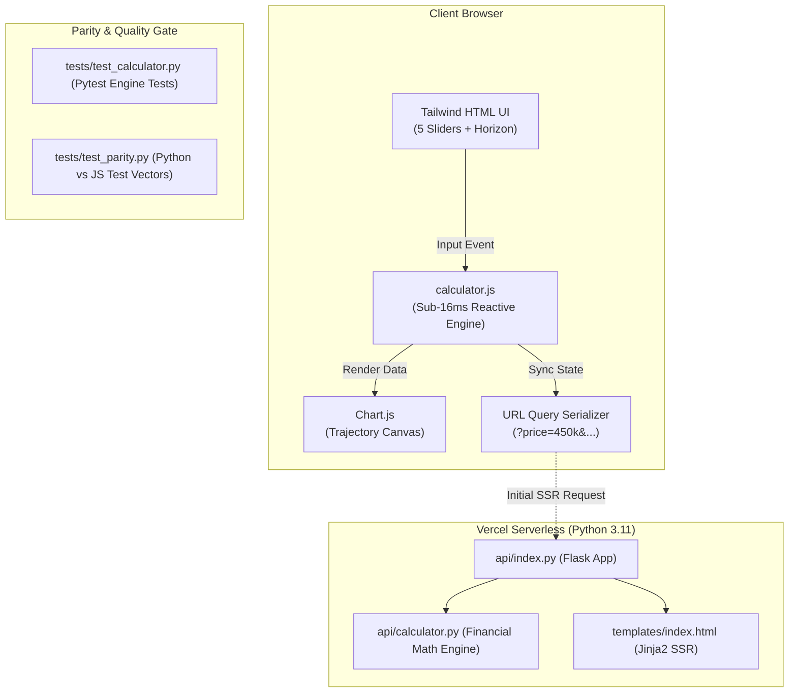

# Implementation Plan: Rent vs. Buy Delta Calculator

## 1. System Architecture



---

## 2. Mathematical Specifications & Core Constants

### A. Fixed Market Constants (Hardcoded Under the Hood)
| Parameter | Symbol | Value | Notes |
|---|---|---|---|
| Annual Home Appreciation | $g$ | 3.5% | Historical nationwide real estate baseline |
| Annual Rent Inflation | $i_{\text{rent}}$ | 3.0% | Historical nationwide rent increase baseline |
| Annual Property Tax & Insurance | $c_{\text{tax\_ins}}$ | 1.5% | Annual escrow expense based on current home value |
| Annual Maintenance & Repairs | $c_{\text{maint}}$ | 1.0% | Annual upkeep expense based on current home value |
| Buyer Closing Costs | $k_{\text{buyer}}$ | 3.0% | Incurred at purchase time based on home price |
| Seller Closing & Broker Fees | $k_{\text{seller}}$ | 6.0% | Incurred at sale exit based on exit home market value |

### B. Core User Inputs (5 Sliders + Horizon)
1. **Target Home Price** ($P_{\text{home}}$, default: \$450,000, range: \$100,000 – \$2,500,000)
2. **Down Payment %** ($d$, default: 20%, range: 3% – 50%)
3. **30-Year Mortgage Interest Rate** ($r_{\text{mort}}$, default: 6.5%, range: 2.0% – 12.0%)
4. **Initial Monthly Rent** ($R_0$, default: \$2,200, range: \$500 – \$15,000)
5. **Expected S&P 500 Annual Return** ($r_{\text{sp}}$, default: 8.0%, range: 2.0% – 15.0%)
6. **Time Horizon** ($H$, default: 30 years, range: 5 – 30 years, with 5-Yr and 30-Yr preset toggles)

### C. Monthly Simulation Steps ($m = 1 \dots 12H$)
1. **Mortgage Amortization**:
   - Loan Principal $L_0 = P_{\text{home}} \times (1 - d)$
   - Monthly Rate $r_m = \frac{r_{\text{mort}}}{12}$
   - Monthly P&I: $M_{\text{PI}} = L_0 \frac{r_m (1 + r_m)^{360}}{(1 + r_m)^{360} - 1}$ for $m \le 360$; $0$ for $m > 360$.
   - Monthly Interest: $I_m = L_{m-1} \times r_m$.
   - Monthly Principal: $P_m = M_{\text{PI}} - I_m$.
   - Remaining Balance: $L_m = \max(0, L_{m-1} - P_m)$.
2. **Monthly Homeownership Cost**:
   - Current Home Value: $V_m = P_{\text{home}} \times (1 + g)^{m / 12}$.
   - Monthly Tax, Insurance & Maintenance: $C_{\text{holding}, m} = V_m \times \frac{c_{\text{tax\_ins}} + c_{\text{maint}}}{12}$.
   - Total Monthly Cost to Buy: $\text{Cost}_{\text{buy}, m} = M_{\text{PI}} + C_{\text{holding}, m}$.
3. **Monthly Renting Cost**:
   - $\text{Rent}_m = R_0 \times (1 + i_{\text{rent}})^{\lfloor (m - 1) / 12 \rfloor}$.
4. **Renter Portfolio Compounding & Cashflow Delta**:
   - Initial Portfolio: $S_0 = (P_{\text{home}} \times d) + (P_{\text{home}} \times k_{\text{buyer}})$.
   - Monthly Stock Market Rate: $r_{\text{sp}, m} = (1 + r_{\text{sp}})^{1/12} - 1$.
   - Cashflow Delta: $\Delta_m = \text{Cost}_{\text{buy}, m} - \text{Rent}_m$.
   - End of Month Portfolio: $S_m = \max\left(0, S_{m-1} \times (1 + r_{\text{sp}, m}) + \Delta_m\right)$.
5. **Yearly Net Worth Comparison (Year $N = 1 \dots H$, where $m = 12N$)**:
   - **Buyer Net Worth**: $\text{NW}_{\text{buy}, N} = V_{12N} \times (1 - k_{\text{seller}}) - L_{12N}$.
   - **Renter Net Worth**: $\text{NW}_{\text{rent}, N} = S_{12N}$.
   - **Delta**: $\text{Delta}_N = \text{NW}_{\text{buy}, N} - \text{NW}_{\text{rent}, N}$.

---

## 3. Tech Stack & File Structure

```text
property-vs-portfolio/
├── api/
│   ├── __init__.py
│   ├── calculator.py       # Pure Python financial computation engine
│   └── index.py            # Flask app & Vercel serverless entry point
├── static/
│   └── js/
│       └── calculator.js   # Client-side 60 FPS computation & Chart.js adapter
├── templates/
│   └── index.html          # Clean Jinja2 template with Tailwind CSS CDN
├── tests/
│   ├── __init__.py
│   ├── test_calculator.py  # Python financial logic & edge-case unit tests
│   └── test_parity.py      # Golden vector parity test between Python and JS engines
├── requirements.txt        # Flask, pytest, gunicorn
├── vercel.json             # Vercel serverless configuration
├── requirements.md         # Source of truth project requirements
└── task.md                 # Granular work items and execution tracking
```

---

## 4. UI/UX Layout Specification
* **Top Bar**: Minimalist brand title + instant "Copy Link" / "Share Scenario" button with toast notification.
* **Two-Column Responsive Grid**:
  * **Left Column (Inputs)**:
    * 5 synchronized sliders with direct number inputs:
      1. Home Price
      2. Down Payment %
      3. Mortgage Rate %
      4. Monthly Rent
      5. S&P 500 Return %
    * Horizon Selector: 5 to 30 years slider + "5 Years" and "30 Years" quick pills.
    * Concise assumptions note at the bottom detailing the hardcoded rates.
  * **Right Column (Results & Visualizations)**:
    * **Hero Delta Card**: High-contrast winner announcement (e.g. "Buying wins by $142,350 at Year 30" with green/blue accent).
    * **Crossover / Breakeven Badge**: "Breakeven reached in Year 6" (or "Renting always wins").
    * **Chart.js Trajectory**: Interactive dual-line chart showing Net Worth over the selected horizon, styled with smooth tooltips and distinct colors (Emerald for Buy, Indigo for Rent & Invest).
    * **Milestones Snapshot**: Dynamic grid showing snapshots at Year 5, 10, 20, 30 (filtered to $\le H$).
